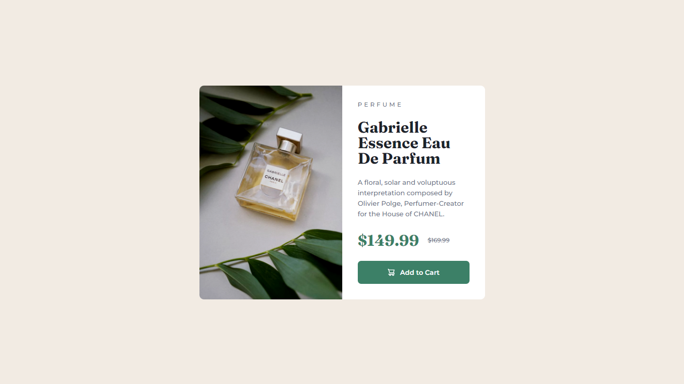

# Frontend Mentor - Product preview card component solution

This is a solution to the [Product preview card component challenge on Frontend Mentor](https://www.frontendmentor.io/challenges/product-preview-card-component-GO7UmttRfa). Frontend Mentor challenges help you improve your coding skills by building realistic projects.

## Table of contents

- [Overview](#overview)
  - [The challenge](#the-challenge)
  - [Screenshot](#screenshot)
  - [Links](#links)
- [My process](#my-process)
  - [Built with](#built-with)
  - [Continued development](#continued-development)

## Overview

### The challenge

Users should be able to:

- View the optimal layout depending on their device's screen size
- See hover and focus states for interactive elements

### Screenshot

### Links

- Solution URL: https://github.com/canalebruno/002-product-preview-card-component
- Live Site URL: https://002-product-preview-card-component.vercel.app/

## My process

### Built with

- Semantic HTML5 markup
- SASS
- Flexbox
- CSS Grid
- [React](https://reactjs.org/) - JS library
- [Next.js](https://nextjs.org/) - React framework

### Continued development

- Am I using the HTML tags on their right place? Accessibility?
- When changing colour on hover, is better to change the colour hex or just use a brightness filter?
- For those images, is it better to use them as background on a div tag or as an image tag?
